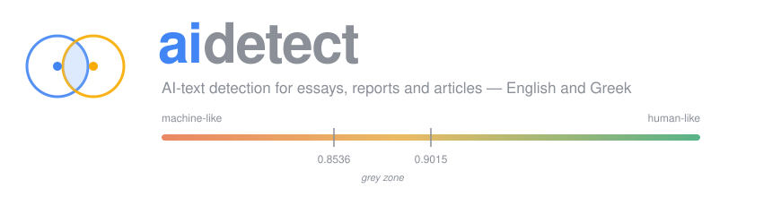
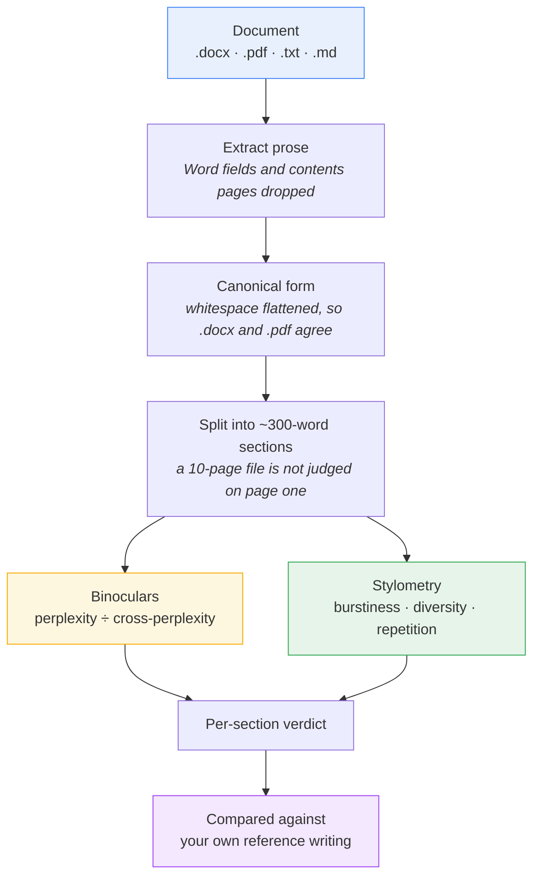

<p align="center">
  
</p>

<p align="center">
  <a href="#install"></a>
  
  
  
</p>

**AI writing forensics for essays, reports and articles — English and Greek.**

**Detect** how machine-like a piece of writing reads · **Explain** which
passages are responsible and why · **Compare** against writing you know people
wrote · **Calibrate** a threshold on your own material rather than someone
else's benchmark.

Everything runs on your machine. Documents are never uploaded anywhere; only
model weights are downloaded, once. The writing indicators need no model, no
network and no GPU at all.

A single "87% AI" number is not worth much, and the research says so. What is
worth something is *this passage has very even sentence lengths and repeats
itself, which reads as formulaic* — an observation you can act on, and one that
holds whichever detector someone else happens to run.

It is a diagnostic, not a verdict. The
[limitations](#known-limitations-by-design-of-the-problem-not-the-code) are
substantial and stated plainly, and [BENCHMARK.md](BENCHMARK.md) records what
has actually been measured — including two of five human-written samples being
wrongly flagged.

## How it works



Binoculars needs a GPU and no training data. Stylometry needs neither — it runs
on any machine, in English and Greek, and is what tells you *what to change*
rather than only *how bad it is*.

### Where the thresholds sit

```
      more machine-like  ◄────────── score ──────────►  more human-like

              0.8536              0.9015
                 │                   │
    ─────────────┼───────────────────┼──────────────────────────►
      flagged    │    grey zone      │    reads as human
     by both     │  modes disagree   │      by both
                 │                   │
              lenient            standard

    ▲ measured: formal, human-written prose lands here (0.73 - 0.89)
```

That last line is the point. Templated writing is predictable by design, and
predictability is exactly what this measures — so it scores low whoever wrote
it. Calibrate on your own writing before reading anything into a verdict.

## Detectors

**1. Binoculars (zero-shot, GPU)** — `aidetect/binoculars.py`

No training data needed. Scores text with a base/instruct model pair; AI text scores *low* (perplexity/cross-perplexity ratio). **Both models are resident at once**, so the Falcon-7B pair needs roughly 28GB in bf16 — more than a single 24GB card holds. Two GPUs get one model each automatically; on one card use a smaller pair (`--pair qwen2.5-1.5b`) or `device="auto"` to shard both across whatever GPUs are present. A Qwen2.5-7B pair also works and is faster on newer hardware.

```python
from aidetect.binoculars import Binoculars

det = Binoculars()  # downloads falcon-7b + falcon-7b-instruct (~28GB)
r = det.score(open("sample.txt").read())
print(r.score, r.is_ai)
```

CLI: `aidetect suspicious.txt` (or `python -m aidetect suspicious.txt`)

**2. FeatureDetector (supervised, CPU)** — `aidetect/classifier.py`

15 stylometric features (burstiness, lexical diversity, punctuation rates, entropy — Greek-aware tokenization) into gradient boosting. Trains in seconds, fully interpretable, but domain-sensitive: retrain per domain.

```python
from aidetect import FeatureDetector, evaluate, pick_threshold

det = FeatureDetector().fit(train_texts, train_labels)  # 1 = AI, 0 = human
probs = det.predict_proba(test_texts)
print(evaluate(probs, test_labels, max_fpr=0.01))
det.save("detector.pkl")
```

## Evaluation

`evaluate()` reports AUROC plus TPR/FPR at an operating threshold. `pick_threshold(scores, labels, max_fpr=0.01)` picks the threshold maximizing detection subject to a false-positive budget — **FPR is the deployment metric that matters**; falsely flagging a human is usually the costly error.

Convention: higher score = more likely AI. For Binoculars, negate the raw score before passing to `evaluate()`.

## Recommended workflow

1. Assemble a domain-matched eval set: real human text from your target domain, plus AI text from several generators. Local models via LM Studio or vLLM, and hosted ones through their APIs, so the set is not tuned to one generator.
2. Run Binoculars as the baseline; record AUROC and FPR@threshold.
3. Train FeatureDetector on the same data; compare.
4. Stress-test: paraphrase the AI texts (e.g. with DIPPER or any local model prompted to rewrite) and re-measure. Expect significant degradation — this is the known weakness of all current detectors.
5. Re-tune the threshold with `pick_threshold` on domain data before deployment.

## Known limitations (by design of the problem, not the code)

- Short texts (<100 tokens) are unreliable; the CLI warns below 50 words.
- Paraphrasing attacks defeat most detectors.
- **Non-native English writers are systematically over-flagged.** Liang,
  Yuksekgonul, Mao, Wu and Zou, [GPT detectors are biased against non-native
  English writers](https://doi.org/10.1016/j.patter.2023.100779) (*Patterns*
  4(7), 2023; [arXiv:2304.02819](https://arxiv.org/abs/2304.02819)), found
  detectors misclassifying over half of TOEFL essays by non-native writers as
  AI-generated while correctly clearing essays by native writers. Simpler
  vocabulary and conventional grammar are exactly what perplexity reads as
  predictable. Report probabilities with confidence bands, never binary
  verdicts, in anything user-facing — and calibrate on writing from the same
  population before trusting a threshold.
- Binoculars' default threshold (0.9015) was tuned for the Falcon pair on English; re-tune for other model pairs or languages.

## Install

```
pip install -r requirements.txt            # CPU parts (sklearn, numpy, docx, pdf)
pip install torch transformers accelerate  # for Binoculars (GPU)
pytest                                     # 117 tests, CPU-only
```

## Desktop app / standalone executable

Builds a Windows `.exe` that runs on machines with **no Python installed**.

```powershell
.\packaging\build.ps1          # full:  dist\aidetect-full\aidetect-full.exe
.\packaging\build.ps1 -Lite    # lite:  dist\aidetect-lite.exe
.\packaging\build.ps1 -Both    # both, lite first
```

| | Full (default) | Lite (`-Lite`) |
|---|---|---|
| Size | ~4.4 GB with CUDA torch, one folder | 68 MB, single file |
| Binoculars (zero-shot score) | yes | no |
| Writing indicators | yes | **yes** |
| Trained classifier | with your `.pkl` | with your `.pkl` |
| Needs a GPU | for practical speed | no |
| Build needs | torch + transformers installed | nothing extra |

**The lite build is useful on its own.** It cannot produce a Binoculars score,
but the writing indicators — burstiness, vocabulary range, repeated phrasing —
need no model, no download and no GPU, and work in Greek and English. They are
also the part that transfers: every detector measures predictability, so a
passage with very even sentence lengths reads as formulaic to all of them.

**Use the full build if you want a score.** Binoculars is zero-shot: no model
file, no threshold, nothing to train.

Double-click the executable and it opens a window: **Browse…** for a `.txt`,
`.md`, `.docx` or `.pdf`, then hit **Analyse**. The text pane is editable, so you
can paste text instead of loading a file. A detector the build cannot run is
greyed out rather than failing when you pick it. Same window from a Python
install with `aidetect --gui`.

Given arguments, it stays a normal CLI:

```
aidetect-lite.exe report.pdf
aidetect-lite.exe suspicious.docx --detector features --model detector.pkl
```

Two things to know before shipping it:

- The full build bundles the Python runtime, **not the model weights** —
  Binoculars downloads the Falcon pair (~28GB) from Hugging Face on first run,
  so it is not usable offline and the first run is slow.
- The build picks up **whichever torch is installed**, and that decision is
  baked in. Build against a CUDA torch and the exe runs on GPU *and* non-GPU
  machines: a CUDA wheel imports fine where there is no NVIDIA hardware, and
  the app falls back to CPU on its own. Build against a CPU-only torch and it
  will never use a GPU, however capable the target machine.

  ```
  pip install torch==2.11.0 --index-url https://download.pytorch.org/whl/cu128
  ```

  cu128 covers Ampere through Blackwell (3090 and 5090 both). cu126 pairs with
  a newer torch but ships no sm_120 kernels, so it fails on a 5090.

### Building the full version yourself

The lite executable is the one published under Releases, because the full build
is far past the 2 GB limit GitHub allows per file. Building it locally is better
anyway: you get a torch matched to your own GPU rather than one pinned to
whatever the release was compiled against.

```powershell
git clone https://github.com/adamopoulosa1980/aidetect
cd aidetect

conda create -n aidetect python=3.10 -y      # 3.10-3.12 all work; 3.10 is what 1.6.0 was built and tested on
conda activate aidetect

# CUDA build - cu128 covers Turing through Blackwell (RTX 2080 Ti to 5090)
pip install torch==2.11.0 --index-url https://download.pytorch.org/whl/cu128
pip install -e ".[gpu,build]"

.\packaging\build.ps1                    # -> dist\aidetect-full\aidetect-full.exe
```

Roughly 7 minutes and 4.4 GB of output. Check it picked up your GPU:

```powershell
.\dist\aidetect-full\aidetect-full.exe --gui   # grey line should read "GPU ready: ..."
```

If it says no CUDA GPU on a machine that has one, the NVIDIA driver is usually
too old — CUDA 12.8 wants roughly 570 or newer.

**On a machine with no NVIDIA card** the same executable still runs; it falls
back to CPU and reports `device=cpu`. Binoculars on CPU needs about 28 GB of RAM
for the Falcon pair and takes minutes per section, so it is a fallback rather
than a way to work.

For a CPU-only build, skip the CUDA index and `pip install torch` normally. The
result is smaller but can never use a GPU, whatever it is run on.

Under the hood [aidetect.spec](aidetect.spec) drives PyInstaller and honours the
`AIDETECT_LITE` / `AIDETECT_ONEFILE` environment variables, if you would rather
invoke `pyinstaller --clean --noconfirm aidetect.spec` yourself.

## Usage

```
aidetect DOCUMENT                                   # .txt .md .docx .pdf
aidetect DOCUMENT --save-md                         # also write DOCUMENT.md
aidetect DOCUMENT --sections                        # score every section, not just page 1
aidetect DOCUMENT --sections --mode low-fpr         # lenient threshold
aidetect DOCUMENT --stylometry                      # indicators only, no model
aidetect --gui                                      # graphical interface
aidetect DOCUMENT --detector features --model m.pkl # CPU stylometric
echo "some text" | aidetect                         # stdin
echo "some text" | aidetect-lite.exe -              # stdin, frozen build
python -m aidetect DOCUMENT                         # without the console script
```

Exit codes: `0` verdict printed, `1` input could not be read, `2` the requested
detector is unavailable in this build.

The frozen executable opens the GUI when run with no arguments, since that means
it was double-clicked rather than piped into. Use `-` to pipe into it explicitly.

### What actually gets scored

Scoring runs on a canonical flat form of the text: paragraph breaks and line
wraps are collapsed to single spaces, and non-breaking spaces, zero-width
characters and CRLF are cleaned up.

This is not cosmetic. Whitespace is made of tokens, so it counts towards
perplexity. python-docx emits a newline per paragraph, pypdf emits one at every
*visual* line wrap — mid sentence, a pure layout artefact — and a paste carries
whatever the clipboard held. Measured on one five-paragraph document, those
spellings scored **3.82% apart**, wider than the margin many documents sit from
the threshold: one document could get opposite verdicts as .docx and as
.pdf. Normalising removes that, so the four spellings now agree to eight
decimal places.

The window still shows the readable text with paragraphs intact; only the
scored string is flat.

Detection runs on plain prose, not Markdown. Word field results — table-of-
contents entries, cross-references, and placeholders like "No table of figures
entries found." — are boilerplate Word generates rather than text the author
wrote, so they are stripped, along with TOC-styled paragraphs. They are matched
structurally rather than by their wording, which Word localises.

Markup is deliberately not fed to the detectors: Binoculars would measure its
perplexity, and `features.dash_rate` counts " - ", which is exactly a Markdown
bullet — converting first would corrupt the stylometric features on every
document. `--save-md` writes a structured Markdown copy for reading and keeping,
separate from the flat text that gets scored.


### Operating modes and what actually gets scored

Both modes compute the **same score**; only the threshold differs.

| Mode | Threshold | Behaviour |
|---|---|---|
| `accuracy` (default) | 0.9015310749276843 | The reference default — what a stock detector uses |
| `low-fpr` | 0.8536432310785527 | Lower cut, so fewer documents are called AI-generated |

A lower threshold means less text falls below it, so **low-fpr raises fewer false
alarms but misses more genuinely AI-written text**. There is no threshold that
improves both. Documents scoring between the two are the only ones where the
modes disagree.

Both constants come from the reference implementation and are pinned by tests.
Do not tune them: they are what makes this predict *another* detector's verdict.
Re-tuning is for judging your own documents, a different question that
`evaluate.pick_threshold()` answers.

**Long documents are truncated.** Binoculars sees 512 tokens, roughly 380 words,
so a 10-page document would otherwise be judged on its first page alone. Pass
`--sections` (on by default in the GUI) to score the whole document in
overlapping passages and see which ones would be flagged:

```
2/17 sections would be flagged  mean=0.9312  threshold=0.9015
  [ 1] 0.9871      Fieldwork ran from March to September, mostly in poor...
  [ 7] 0.8402 FLAG The study measured rainfall at three upland sites each...
       burstiness -0.31  sentences 24+-3 words  diversity 0.41
       - sentence lengths are very even; varying them reads as more human
```

Formal, templated prose — academic essays, reports, edited journalism — is intrinsically
low-perplexity and therefore scores lower than casual writing. That is a property
of the method, not a defect: good formulaic writing is predictable, and
predictability is what Binoculars measures.
Binoculars picks its hardware at run time: CUDA where a GPU is present, CPU
otherwise, with the dtype following the device (bfloat16 on Ampere and later,
float16 on older GPUs, float32 on CPU). The verdict line reports which it used.

Scoring from Python goes through one entry point, whichever detector you pick:

```python
from aidetect import load_text, score_text

verdict = score_text(load_text("report.pdf"), "features", model="detector.pkl")
print(verdict.label, verdict.score)   # 'AI-generated' 0.87
```

Benchmarking, once you have labelled documents:

```
aidetect-benchmark corpus/ --max-fpr 0.01 --output results.md
```

To see the output without assembling a corpus first,
`examples/build_example_corpus.py` regenerates a small one from public data.
It is an **example** corpus, not a validation corpus, and its numbers show the
output format rather than saying anything about detection quality.

See [BENCHMARK.md](BENCHMARK.md) for the layout, what has actually been
measured, and one trap worth avoiding. [CHANGELOG.md](CHANGELOG.md) has the
release history.

## Credits

The zero-shot detector implements the Binoculars method:

> Abhimanyu Hans, Avi Schwarzschild, Valeriia Cherepanova, Hamid Kazemi,
> Aniruddha Saha, Micah Goldblum, Jonas Geiping, Tom Goldstein.
> **Spotting LLMs With Binoculars: Zero-Shot Detection of Machine-Generated
> Text.** ICML 2024, PMLR 235. [arXiv:2401.12070](https://arxiv.org/abs/2401.12070)

```bibtex
@inproceedings{hans2024binoculars,
  title     = {Spotting {LLM}s With Binoculars: Zero-Shot Detection of
               Machine-Generated Text},
  author    = {Hans, Abhimanyu and Schwarzschild, Avi and Cherepanova, Valeriia
               and Kazemi, Hamid and Saha, Aniruddha and Goldblum, Micah and
               Geiping, Jonas and Goldstein, Tom},
  booktitle = {Proceedings of the 41st International Conference on Machine Learning},
  series    = {Proceedings of Machine Learning Research},
  volume    = {235},
  year      = {2024},
  eprint    = {2401.12070},
  archivePrefix = {arXiv},
}
```

The reference implementation is at
[github.com/ahans30/Binoculars](https://github.com/ahans30/Binoculars),
BSD 3-Clause. Both operating thresholds used here — `0.9015310749276843`
(accuracy) and `0.8536432310785527` (low false positive rate) — are that
implementation's published constants, reproduced unchanged so that results
remain comparable with it. `aidetect/binoculars.py` is an independent
implementation of the published method, checked against the reference's own
formulation; any error in it is ours, not the authors'.

Models are the authors' recommended pair, [tiiuae/falcon-7b](https://huggingface.co/tiiuae/falcon-7b)
and [tiiuae/falcon-7b-instruct](https://huggingface.co/tiiuae/falcon-7b-instruct),
downloaded from Hugging Face under their own licences.

The stylometric detector, the readers, the sectioning and the calibration are
this project's own work and are not part of the Binoculars method.

The limitation most worth reading before relying on any of this:

> Weixin Liang, Mert Yuksekgonul, Yining Mao, Eric Wu, James Zou.
> **GPT detectors are biased against non-native English writers.**
> *Patterns* 4(7), 2023. [arXiv:2304.02819](https://arxiv.org/abs/2304.02819)


## Licence

BSD 3-Clause — see [LICENSE](LICENSE). The same licence as the Binoculars
reference implementation this project's zero-shot detector is checked against,
so the whole lineage stays under one set of terms.

The Falcon models are downloaded from Hugging Face under their own licences and
are not covered by this one.
